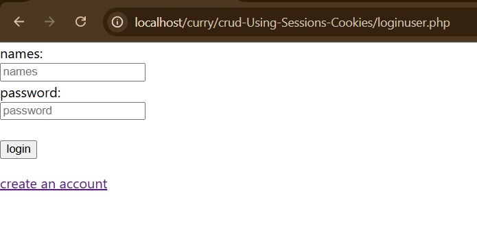
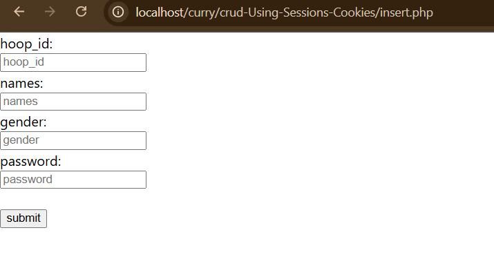
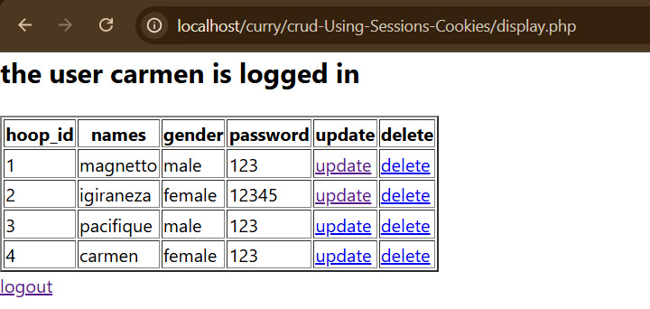
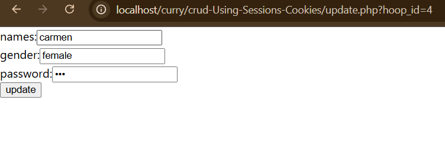

# crud-Using-Sessions-Cookies
 crud_Using Sessions &amp; Cookies

at first when you login it is like this.

if you have an account you log in your name and password 
if you don't have an account then you click on create account button

when you click on the create account button then you are directed to the page of creating an account.

and when you create an account they direct you to log in and when the credentials are true then you are on the display page .

therefore when you reach on the dispay they show you the name of the user entered as you have seen 
you are able to update and delete 
here is the interface to update

